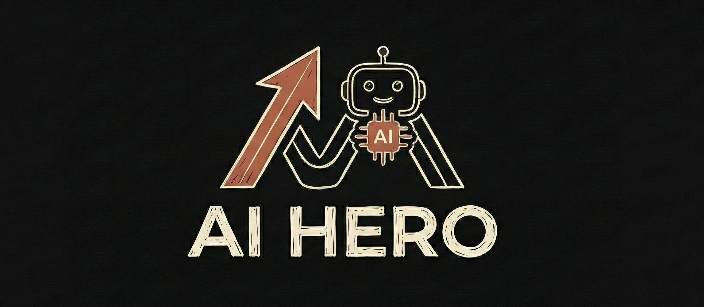

# AI Agents Roadmap: From Zero to Hero 

  

[](https://www.python.org/)
[](./docs)
[](./LICENSE)
[](https://github.com/HelloGGX/AI-Agents-Zero-to-Hero/stargazers)

> A comprehensive, hands-on roadmap for learning AI Agents from scratch, inspired by roadmap.sh. Build practical skills to land your first AI job.

## Project Overview

This open-source repository is your structured guide to mastering AI Agents. Whether you're a complete beginner or an aspiring AI engineer without real-world experience, this project documents a step-by-step learning journey. It covers fundamentals to advanced topics, with code examples, tutorials, and projects to help you build a portfolio for job offers.

Key focus: Turn theoretical knowledge into actionable skills. No more scattered resources—everything in one place for systematic learning.

  


## Who This Is For

- **Beginners**: Zero foundational knowledge? Start here for a clear, progressive path.
- **Job Seekers**: Gain practical experience to ace interviews and secure AI roles.
- **Self-Learners**: Those willing to invest in premium resources for deeper, guided mastery.

Free core content is open-source. For premium video courses, exclusive projects, and community support, check our [membership options](https://patreon.com/HelloGGX) or [courses](https://teachable.com/HelloGGX).

## Key Features

- **Structured Roadmap**: Divided into phases mirroring roadmap.sh (e.g., LLM Fundamentals, Agent Architectures, Building Agents).
- **Code Examples**: Python-based implementations for concepts like ReAct loops, tool invocation, and RAG integration.
- **Practical Projects**: Build real agents (e.g., personal assistant, data analyzer) to showcase in portfolios.
- **Resources**: Curated links, cheat sheets, and quizzes for self-assessment.
- **Updates**: Regular additions based on 2026 AI trends (e.g., new models, ethics guidelines).

## Learning Roadmap

Follow this phased approach to build expertise:

| Phase | Topics Covered | Resources |
|-------|----------------|-----------|
| **Phase 1: Prerequisites** | Backend basics, Git, REST APIs, LLM fundamentals (Transformers, Tokenization, Embeddings, RAG basics). | `./docs/prerequisites.md`, Code in `./src/prerequisites/` |
| **Phase 2: AI Agents 101** | What are Agents/Tools? Agent Loop (Perception, Reason, Act, Observe). Prompt Engineering techniques. | `./docs/agents-101.md`, Examples in `./src/agents-101/` |
| **Phase 3: Tools & Memory** | Tool definitions, examples (Web Search, Code Execution). Agent Memory (Short/Long-term, RAG, Summarization). | `./docs/tools-memory.md`, Implementations in `./src/tools-memory/` |
| **Phase 4: Architectures** | ReAct, Chain of Thought, MCP, RAG Agents, DAG/Tree-of-Thought. | `./docs/architectures.md`, Advanced code in `./src/architectures/` |
| **Phase 5: Building & Frameworks** | Manual builds (LLM APIs, Function Calling). Frameworks (LangChain, AutoGen, CrewAI). | `./docs/building.md`, Projects in `./src/projects/` |
| **Phase 6: Evaluation & Security** | Testing metrics, Debugging tools (LangSmith). Ethics (Prompt Injection, Bias Guardrails). | `./docs/evaluation-security.md`, Tools in `./src/evaluation/` |

For interactive quizzes and video walkthroughs, upgrade to premium access.

## Getting Started

### Prerequisites
- Python 3.10+
- Basic command-line knowledge
- OpenAI API key (for examples)

### Installation
1. Clone the repo:
   ```bash
   git clone https://github.com/HelloGGX/AI-Agents-Zero-to-Hero
   cd ai-agents-roadmap
   ```
2. Set up environment:
   ```bash
   python -m venv venv
   source venv/bin/activate  # Windows: venv\Scripts\activate
   pip install -r requirements.txt
   ```
3. Configure `.env`:
   ```
   OPENAI_API_KEY=your-key-here
   ```

### Quick Example
Run a basic agent demo:
```bash
python src/agents-101/simple-agent.py
```
This demonstrates a ReAct loop for a simple task.

Explore `./src/projects/` for full builds.

## Contributing

We welcome contributions to improve the roadmap! 
- Fork and create a PR with enhancements (e.g., new examples, fixes).
- Follow PEP8 style; test with `pytest`.
- See [CONTRIBUTING.md](./CONTRIBUTING.md) for guidelines.

## Community & Support

- **Discussions**: Join [GitHub Discussions](https://github.com/HelloGGX/ai-agents-roadmap/discussions) for questions.
- **Premium Community**: Access Q&A, live sessions via [Patreon](https://patreon.com/HelloGGX).
- **Contact**: Gavin  
  - X/Twitter: [@gavincoding](https://x.com/gavincoding?s=21)
  - Email: gavin_cat@outlook.com

## Related Resources

- Original inspiration: [roadmap.sh AI Agents](https://roadmap.sh/ai-agents)
- Frameworks: [LangChain](https://github.com/langchain-ai/langchain), [CrewAI](https://github.com/joaomdmoura/crewAI)
- Other Roadmaps: AI Engineer, MLOps from roadmap.sh

## License

MIT License. See [LICENSE](./LICENSE).

---

Star ⭐ this repo if it helps your journey. For accelerated learning with premium content, explore our [courses and membership](https://teachable.com/HelloGGX). Let's democratize AI Agents education! 🚀
